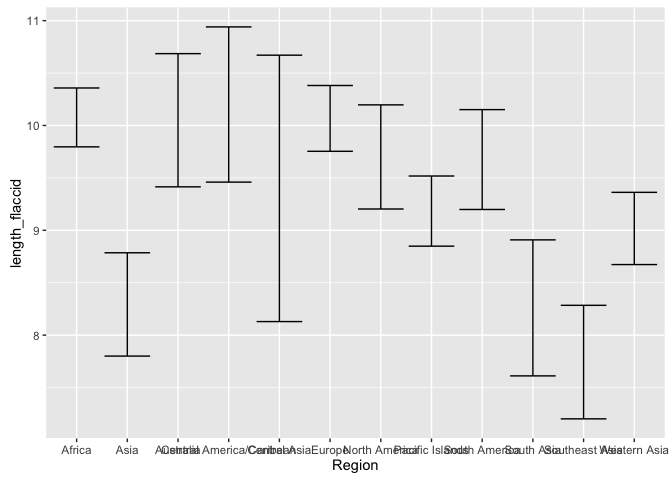
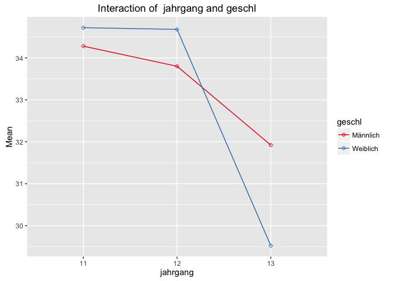

<!-- README.md is generated from README.Rmd. Please edit that file -->
tadaatoolbox
============

[](https://travis-ci.org/tadaadata/tadaatoolbox) [](http://cran.r-project.org/package=tadaatoolbox) [](http://www.repostatus.org/#wip)

This is **TadaaToolbox** version `0.8.0` ([semver](http://semver.org/)).
It's a toolbox of common convenience function meant to ease workflows.

Installation
============

Install the current development version from GitHub:

    if (!("devtools" %in% installed.packages())){
      install.packages("devtools")
    }

    devtools::install_github("tadaadata/tadaatoolbox")

Examples
========

Statistical functions
---------------------

-   `modus`: A simple function to extract the mode of a frequency table
-   `nom_chisqu`: Simple wrapper for `chisq.test` that produces a single value.
-   `nom_phi`: Simple wrapper for `vcd::assocstats` to extract phi.
-   `nom_v`: Simple wrapper for `vcd::assocstats` to extract Cramer's V.
-   `nom_c`: Simple wrapper for `vcd::assocstats` to extract the contingency coefficient c.
-   `nom_lambda`: Simple wrapper for `ryouready::nom.lambda` to extract appropriate lambda.
-   `ord_gamma`: Simple wrapper for `ryouready::ord.gamma`.
-   `ord_somers_d`: Simple wrapper for `ryouready::ord.somers.d`.

Misc. helpers
-------------

-   `generate_recodes`: To produce recode assignments for `car::recode` for evenly sequenced clusters.
-   `interval_labels`: To produce labels for clusters created by `cut`.

Tidy test output
----------------

### t-Tests

``` r
library(tadaatoolbox)
library(loldata)

tadaa_t.test(penis, length_flaccid, Method, print = "markdown")
```

<table style="width:114%;">
<colgroup>
<col width="13%" />
<col width="20%" />
<col width="11%" />
<col width="12%" />
<col width="6%" />
<col width="13%" />
<col width="15%" />
<col width="9%" />
<col width="9%" />
</colgroup>
<thead>
<tr class="header">
<th align="right">Measured</th>
<th align="right">Self reported</th>
<th align="right">t</th>
<th align="right">p</th>
<th align="right">df</th>
<th align="right">conf_low</th>
<th align="right">conf_high</th>
<th align="right">d</th>
<th align="right">power</th>
</tr>
</thead>
<tbody>
<tr class="odd">
<td align="right">9.264</td>
<td align="right">9.988</td>
<td align="right">-4.099</td>
<td align="right">&lt; 0.001</td>
<td align="right">144</td>
<td align="right">-1.074</td>
<td align="right">-0.375</td>
<td align="right">0.704</td>
<td align="right">0.981</td>
</tr>
</tbody>
</table>

### ANOVA

``` r
library(tadaatoolbox)
library(loldata)

tadaa_aov(length_flaccid ~ Region, data = penis, print = "markdown")
```

| term      |   df|   sumsq|  meansq|       F|     p.value|  part.eta.sq|
|:----------|----:|-------:|-------:|-------:|-----------:|------------:|
| Region    |   11|  81.817|   7.438|  11.529|  &lt; 0.001|        0.486|
| Residuals |  134|  86.453|   0.645|      NA|          NA|          0.5|

Helpers for plots
-----------------

### CI based on t-distribution: `mean_ci_t` and `confint_t`

``` r
library(ggplot2)
library(tadaatoolbox)
library(loldata)

ggplot(data = penis, aes(x = Region, y = length_flaccid)) +
  stat_summary(fun.data = "mean_ci_t", geom = "errorbar")
```

<!-- -->

### Interaction plots

``` r
tadaa_int(data = ngo, response = stunzahl, group1 = jahrgang, group2 = geschl)
```

<!-- --><!-- -->
